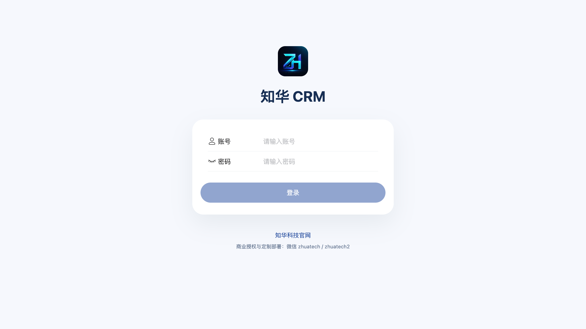
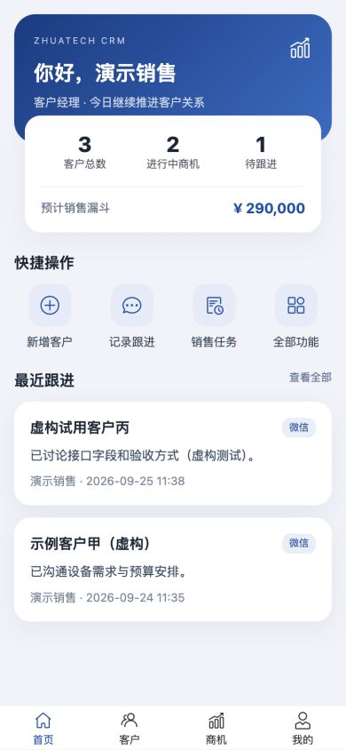
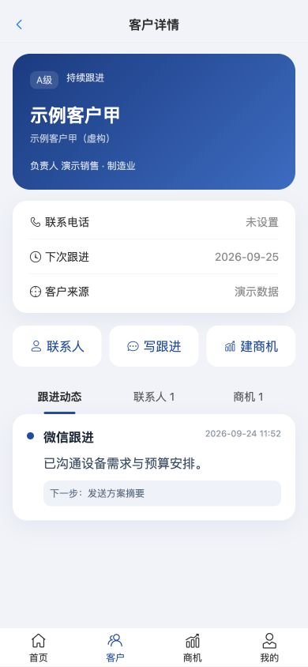
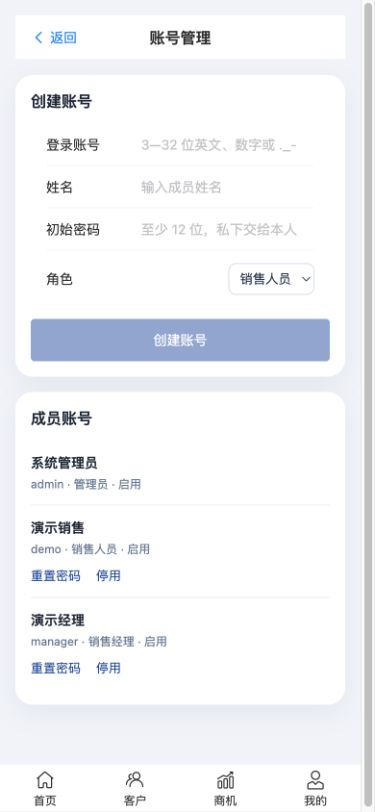
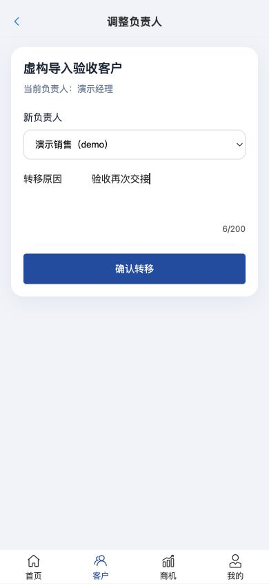
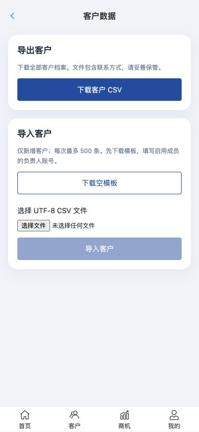
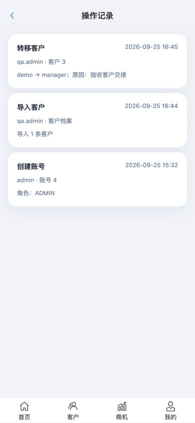

# ZhuaTech CRM — 知华科技 CRM 社区源码版

[](LICENSE)
[](backend/pom.xml)
[](backend/pom.xml)
[](frontend/package.json)

ZhuaTech CRM（知华 CRM）是由 **[知华科技（上海如静知华信息科技有限公司）](https://www.zhuatech.cn/)** 提供源码的移动客户关系管理系统。销售人员可记录客户、联系人、商机、跟进和任务；管理员可查看销售工作台。前端为 Vue 3 H5，后端为 Java 21 / Spring Boot，数据存储使用 MySQL。



本地运行实拍，业务记录均为虚构验收数据：

| 销售首页 | 客户详情 | 账号管理 |
| --- | --- | --- |
|  |  |  |

| 客户交接 | 客户数据 | 操作记录 |
| --- | --- | --- |
|  |  |  |

后文单列的规则 API 不代表已有对应的 H5 操作页面。

> [!IMPORTANT]
> **使用限制：本工程仅允许个人用于非商业性的学习、研究与技术交流，不得用于任何商业用途。企业内部使用、生产部署、SaaS、项目交付、咨询实施、二次开发后销售或其他直接、间接商业使用，均须事先取得上海如静知华信息科技有限公司的书面商业授权。完整条款请阅读 [LICENSE](LICENSE)。**

> 本项目为“源码开放/社区源码版”，因包含非商业限制，不属于 OSI 定义的开源软件。

> 官方网站：[https://www.zhuatech.cn/](https://www.zhuatech.cn/) · 商业授权、深度开发、私有化部署与定制功能，请联系知华科技。

## 功能特性

- 客户管理：客户档案、等级、状态、来源、行业、负责人和下次跟进日期
- 联系人管理：客户联系人、主要联系人、职位、电话、邮箱和备注
- 销售商机：预计金额、销售阶段、成交概率、预计成交日期和下一步计划
- 跟进记录：电话、微信、拜访、邮件等方式，跟进内容与后续行动可追溯
- 销售任务：关联客户、优先级、截止日期、完成状态和个人任务清单
- 销售工作台：客户数量、进行中商机、预计销售漏斗、待跟进和待办统计
- 权限基础：管理员、销售经理、销售人员角色及销售数据范围控制
- 账号管理：管理员创建、启停账号并重置成员密码；成员可修改本人密码，旧登录随即失效
- 客户交接：经理或管理员填写原因后转移负责人，关联商机和任务同步转移
- 数据迁移：管理员按 UTF-8 CSV 模板导入和导出客户档案；错误行使整批导入失败
- 操作记录：管理员可查看最近 100 条账号及核心业务修改记录；交接原因避免填写敏感信息
- 移动 H5：面向手机端的客户卡片、商机推进、快速拨号与跟进录入
- 工程能力：JWT、MySQL 迁移、数据库备份、Docker Compose、Nginx 和 GitHub Actions CI

## 技术架构

| 层级 | 技术 |
| --- | --- |
| H5 前端 | Vue 3、Vite、Vant、Pinia、Vue Router、Axios |
| Java 后端 | Java 21、Spring Boot、Spring Security、Spring Data JPA、Flyway |
| 数据库 | MySQL 8.4（测试环境可使用 H2） |
| 部署 | Docker、Docker Compose、Nginx |

后端使用 `cn.zhuatech.crm` 根包名，前后端通过 REST API 解耦。使用步骤见[操作手册](docs/操作手册.md)，技术细节见[架构文档](docs/ARCHITECTURE.md)和[API 文档](docs/API.md)。

## 本地演示启动

前置条件：Python 3.8+、Docker Desktop / Docker Engine 24+ 与 Docker Compose v2+。以下方式仅供个人非商业学习环境使用；商业或生产部署前须取得书面授权。

```bash
python3 scripts/init_demo_env.py
docker compose up --build -d
```

浏览器在本机访问：<http://localhost:8088>。首次生成的 `.env` 仅允许本机读取且已被 Git 忽略；请妥善保存，不要上传或发送给他人。脚本不会覆盖已有 `.env`。

| 类型 | 账号 | 密码所在配置项 |
| --- | --- | --- |
| 销售体验 | `demo` | `.env` 中的 `CRM_DEMO_PASSWORD` |
| 销售经理 | `manager` | `.env` 中的 `CRM_DEMO_PASSWORD` |
| 管理员 | `admin` | `.env` 中的 `CRM_ADMIN_PASSWORD` |

本地演示配置将 Web 端绑定在 `127.0.0.1`，首次启动会创建两家**虚构**客户、一条销售商机、联系人、跟进记录和销售任务。若将 `CRM_DEMO_ENABLED` 设为 `false`，空库只创建管理员，不创建演示账号和数据。

> 管理员可创建、启停账号并重置其他成员密码；成员可修改本人密码。已有最近 100 条核心修改操作记录，仍缺少企业身份接入、审计长期归档和完整的客户去重机制。商业交付前须禁用演示数据，并按[部署说明](deploy/README.md)与[交付验收清单](deploy/交付验收清单.md)验证 HTTPS、备份恢复与监控。不要直接把本地演示编排暴露到公网。

停止服务：

```bash
docker compose down
```

删除数据库卷会永久清除数据，仅在明确需要重置演示数据时执行：`docker compose down -v`。

## 本地开发

后端需要 JDK 21、Maven 3.9 和 MySQL 8，并设置 `DB_URL`、`DB_USERNAME`、`DB_PASSWORD`、`JWT_SECRET`、`CRM_ADMIN_PASSWORD`。首次空库启动时 `CRM_ADMIN_PASSWORD` 必须至少 12 个字符；要创建演示账号时额外设置 `CRM_DEMO_ENABLED=true` 和 `CRM_DEMO_PASSWORD`。

```bash
cd backend
mvn spring-boot:run
```

前端需要 Node.js 24 与 npm 11：

```bash
cd frontend
npm install
npm run dev
```

默认开发地址为 <http://localhost:5173>，Vite 会将 `/api` 代理到 <http://localhost:8080>。环境变量说明见 [.env.example](.env.example)。

## 项目结构

```text
zhuatech-crm/
├── backend/        # cn.zhuatech.crm Java 后端
├── frontend/       # Vue 3 移动端 H5
├── deploy/         # 部署说明
├── docs/           # 架构与 REST API 文档
├── compose.yaml    # MySQL、后端与前端编排
└── README.md
```

## 后端规则 API 示例

以下能力通过 API 提供，部分尚未接入 H5 页面，接入前可先阅读 [API 文档](docs/API.md)：

- 线索评分、客户健康度、商机加权预测、下一最佳销售动作、AI 销售教练：以规则给出评分或建议；AI 销售教练可选配兼容模型。
- 企业流程校验：线索转客户、[商机阶段门禁](docs/ENTERPRISE_OPPORTUNITY_GATE.md)、[报价与毛利审批](docs/ENTERPRISE_QUOTATION_APPROVAL.md)、[客户归属转移](docs/ENTERPRISE_ACCOUNT_OWNERSHIP_TRANSFER.md)、[客户主数据合并](docs/ENTERPRISE_CUSTOMER_ACCOUNT_MERGE.md)。

以上是可二次开发的规则服务，不等于已连接企业现有 CRM、ERP 或真实审批流程。

## 路线图

- [ ] 线索池、公海客户、客户查重与分配回收
- [ ] 产品、报价、合同、订单、回款和开票管理
- [ ] 销售目标、业绩排行、漏斗分析和预测报表
- [ ] PC 管理后台、字段配置、审计长期归档和细粒度数据权限
- [ ] 企业微信、钉钉、短信、邮件和呼叫中心集成
- [ ] 多租户、开放 API、Webhook 与低代码流程配置

欢迎按 [贡献指南](CONTRIBUTING.md) 提交 Issue 和 Pull Request。安全问题请不要公开披露，处理方式见 [安全策略](SECURITY.md)。

## 使用许可与商业授权

本项目版权归 **上海如静知华信息科技有限公司** 所有，并按照 [ZhuaTech CRM 社区源码许可协议](LICENSE)提供源码：

- 允许自然人用于个人、非商业性的学习、研究、实验和技术交流。
- 允许为上述目的在个人设备上运行和修改，但必须保留许可证、版权与 NOTICE 声明。
- **未经我方事先书面授权，不得用于任何商业用途。** 企业内部使用、生产环境部署、SaaS、托管、项目交付、商业集成、收费或免费商业产品、咨询实施以及可产生直接或间接商业利益的使用，均属于商业使用。
- 商业使用、私有化部署或基于本工程进行商业二次开发，须联系知华科技取得书面商业授权。
- “知华科技”“ZhuaTech”相关名称及标识不因源码可见而授予商标许可。

如果你需要商业授权、CRM 系统深度开发、销售流程定制、私有化部署、系统集成或技术支持，请访问 **[知华科技官网](https://www.zhuatech.cn/)** 联系上海如静知华信息科技有限公司。

## 联系知华科技

官网：[https://www.zhuatech.cn/](https://www.zhuatech.cn/) · 商业授权、定制开发、私有化部署与系统集成咨询微信：`zhuatech` / `zhuatech2`。

扫描下方任一二维码添加微信，可咨询 ZhuaTech CRM 部署、二次开发、功能定制及企业数字化解决方案。

<p align="center">
  
  &nbsp;&nbsp;
  
</p>

<p align="center">任选一个二维码扫码添加微信，联系知华科技</p>

---

Copyright © 2026 上海如静知华信息科技有限公司（知华科技）
