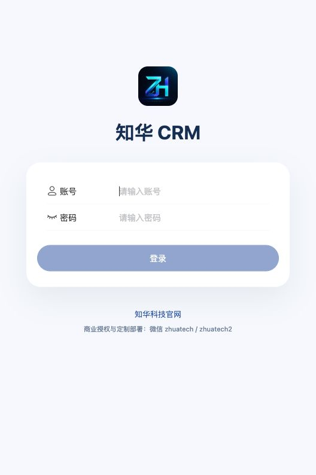
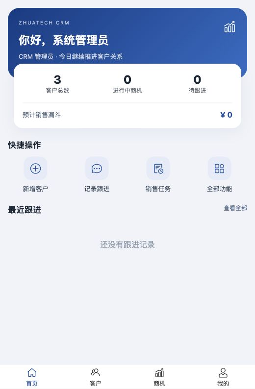
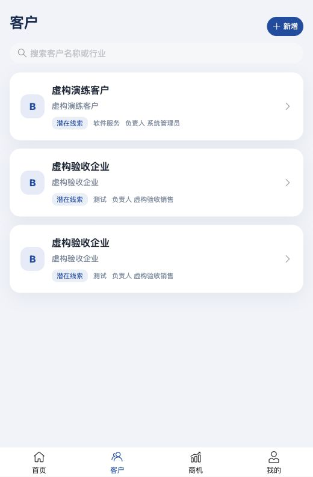
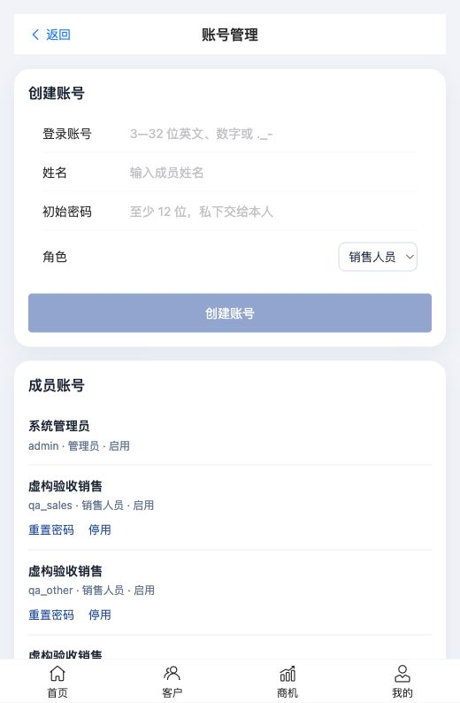
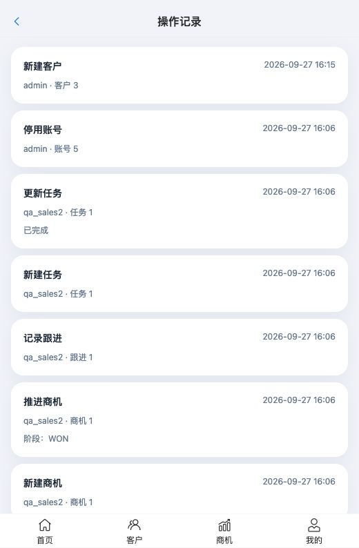
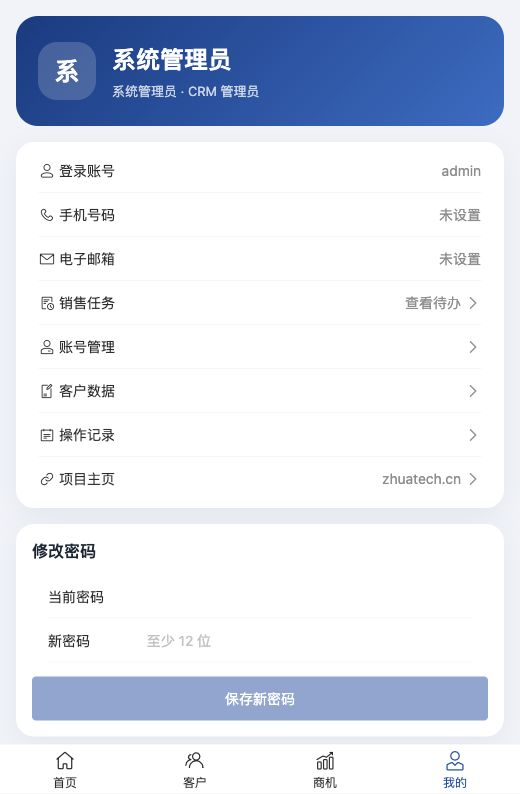

[中文](README.md) | [English](README.en.md)

# ZhuaTech CRM — 知华科技 CRM 公开源码学习版

[个人非商业学习许可](LICENSE) · [Java 21 / Spring Boot 4](backend/pom.xml) · [Vue 3](frontend/package.json)

ZhuaTech CRM（知华 CRM）是由 **[知华科技（上海如静知华信息科技有限公司）](https://www.zhuatech.cn/)** 提供源码的移动客户关系管理系统。销售人员可记录客户、联系人、商机、跟进和任务；管理员可查看销售工作台。前端为 Vue 3 H5，后端为 Java 21 / Spring Boot，数据存储使用 MySQL。

本地启动实拍，业务记录均为虚构验收数据。首页直接展示客户、商机与漏斗指标；统计与首页共用工作台。

| 登录 | 首页与统计 | 核心业务 |
| --- | --- | --- |
|  |  |  |

| 账号管理 | 操作记录 | 个人设置 |
| --- | --- | --- |
|  |  |  |

客户详情、交接和数据导入导出：[客户详情](docs/images/crm-customer-detail.jpg)、[客户交接](docs/images/crm-customer-transfer.jpg)、[客户数据](docs/images/crm-admin-data.jpg)。

后文单列的规则 API 不代表已有对应的 H5 操作页面。

> [!IMPORTANT]
> **使用限制：本工程仅允许个人用于非商业性的学习、研究与技术交流，不得用于任何商业用途。企业内部使用、生产部署、SaaS、项目交付、咨询实施、二次开发后销售或其他直接、间接商业使用，均须事先取得上海如静知华信息科技有限公司的书面商业授权。完整条款请阅读 [LICENSE](LICENSE)。**

> 本项目为“公开源码学习版”，因包含非商业限制，不属于 OSI 定义的开源软件。

> 官方网站：[https://www.zhuatech.cn/](https://www.zhuatech.cn/) · 商业授权、深度开发、私有化部署与定制功能，请联系知华科技。

本项目由知华科技（上海如静知华信息科技有限公司）提供公开源码学习版本，主要用于个人学习、技术研究与非商业交流。未经书面授权不得商用。企业信息化建设、中小企业数字化转型、中小企业 AI 转型、私有化部署、软件外包、软件项目外包、软件实施、FDE 外包、OPC 技术支持及深度定制开发，请访问知华科技官网 <https://www.zhuatech.cn/>，或添加微信 zhuatech、zhuatech2 咨询。

## 适用场景

适合个人学习移动销售工作台、客户归属与交接、客户数据迁移及 Spring Security / JPA 业务建模。取得书面商业授权后可作为定制开发基础；企业评估、内部使用和生产部署同样受现有 LICENSE 限制。

销售端提供客户、联系人、商机、跟进、任务和个人资料；经理可查看团队客户并交接，管理员在同一 H5 的“我的”进入账号管理、客户 CSV 数据与操作记录。当前没有独立 PC 管理后台，界面语言为中文。

## 功能特性

- 客户管理：客户档案、等级、状态、来源、行业、负责人和下次跟进日期
- 联系人管理：客户联系人、主要联系人、职位、电话、邮箱和备注
- 销售商机：预计金额、销售阶段、成交概率、预计成交日期和下一步计划
- 跟进记录：电话、微信、拜访、邮件等方式，跟进内容与后续行动可追溯
- 销售任务：关联客户、优先级、截止日期、完成状态和个人任务清单
- 销售工作台：客户数量、进行中商机、预计销售漏斗、待跟进和待办统计
- 权限基础：管理员、销售经理、销售人员角色及销售数据范围控制
- 账号管理：管理员创建、启停账号并重置成员密码；成员可修改本人密码，旧登录随即失效
- 客户交接：经理或管理员填写原因后转移负责人，关联商机和任务同步转移
- 数据迁移：管理员按 UTF-8 CSV 模板导入和导出客户档案；错误行使整批导入失败
- 操作记录：管理员可查看最近 100 条账号及核心业务修改记录；交接原因避免填写敏感信息
- 移动 H5：面向手机端的客户卡片、商机推进、快速拨号与跟进录入
- 工程能力：JWT、MySQL 迁移、数据库备份、Docker Compose、Nginx 和 GitHub Actions CI

## 技术架构

| 层级 | 技术 |
| --- | --- |
| H5 前端 | Vue 3、Vite、Vant、Pinia、Vue Router、Axios |
| Java 后端 | Java 21、Spring Boot、Spring Security、Spring Data JPA、Flyway |
| 数据库 | MySQL 8.4（测试环境可使用 H2） |
| 部署 | Docker、Docker Compose、Nginx |

后端使用 `cn.zhuatech.crm` 根包名，前后端通过 REST API 解耦。使用步骤见[操作手册](docs/操作手册.md)，技术细节见[架构文档](docs/ARCHITECTURE.md)和[API 文档](docs/API.md)。

## 本地演示启动

前置条件：Python 3.8+、Docker Desktop / Docker Engine 24+ 与 Docker Compose v2+。以下方式仅供个人非商业学习环境使用；商业或生产部署前须取得书面授权。

```bash
python3 scripts/init_demo_env.py
docker compose up --build -d
```

浏览器在本机访问：<http://localhost:8088>。首次生成的 `.env` 仅允许本机读取且已被 Git 忽略；请妥善保存，不要上传或发送给他人。脚本不会覆盖已有 `.env`。

| 类型 | 账号 | 密码所在配置项 |
| --- | --- | --- |
| 销售体验 | `demo` | `.env` 中的 `CRM_DEMO_PASSWORD` |
| 销售经理 | `manager` | `.env` 中的 `CRM_DEMO_PASSWORD` |
| 管理员 | `admin` | `.env` 中的 `CRM_ADMIN_PASSWORD` |

本地演示配置将 Web 端绑定在 `127.0.0.1`，首次启动会创建两家**虚构**客户、一条销售商机、联系人、跟进记录和销售任务。若将 `CRM_DEMO_ENABLED` 设为 `false`，空库只创建管理员，不创建演示账号和数据。

> 管理员可创建、启停账号并重置其他成员密码；成员可修改本人密码。已有最近 100 条核心修改操作记录，仍缺少企业身份接入、审计长期归档和完整的客户去重机制。商业交付前须禁用演示数据，并按[部署说明](deploy/README.md)与[交付验收清单](deploy/交付验收清单.md)验证 HTTPS、备份恢复与监控。不要直接把本地演示编排暴露到公网。

停止服务：

```bash
docker compose down
```

删除数据库卷会永久清除数据，仅在明确需要重置演示数据时执行：`docker compose down -v`。

## 本地开发

后端需要 JDK 21、Maven 3.9 和 MySQL 8，并设置 `DB_URL`、`DB_USERNAME`、`DB_PASSWORD`、`JWT_SECRET`、`CRM_ADMIN_PASSWORD`。首次空库启动时 `CRM_ADMIN_PASSWORD` 必须至少 12 个字符；要创建演示账号时额外设置 `CRM_DEMO_ENABLED=true` 和 `CRM_DEMO_PASSWORD`。

```bash
cd backend
mvn spring-boot:run
```

前端需要 Node.js 24.19.0+ 与 npm 11：

```bash
cd frontend
npm ci
npm run dev
```

默认开发地址为 <http://localhost:5173>，Vite 会将 `/api` 代理到 <http://localhost:8080>。环境变量说明见 [.env.example](.env.example)。

## 数据库初始化与配置

首次空库启动自动依次执行 `backend/src/main/resources/db/migration/` 内的 V1（业务表）、V2（账号令牌版本）和 V3（操作审计），随后 Hibernate 校验实体结构。已发布迁移保持不变，升级新增版本；`mysql_data` 保存业务数据，重启不重新初始化账号密码。关闭演示开关不会删除旧演示记录。

| 配置 | 用途 |
| --- | --- |
| `MYSQL_DATABASE`、`MYSQL_USER`、`MYSQL_PASSWORD`、`MYSQL_ROOT_PASSWORD` | Compose 数据库及初始化凭证；密码示例为空 |
| `DB_URL`、`DB_USERNAME`、`DB_PASSWORD` | 直接运行后端的数据库连接；Compose 自动组装并注入 |
| `CRM_ADMIN_PASSWORD`、`CRM_DEMO_ENABLED`、`CRM_DEMO_PASSWORD` | 空库管理员及可选虚构演示初始化；已存在账号不会因改环境变量而重设 |
| `JWT_SECRET` | 独立随机签名密钥；JWT 有效期 24 小时，账号密码变化或停用会使旧令牌失效 |
| `WEB_PORT`、`WEB_BIND_ADDRESS`、`CORS_ORIGINS` | Web 入口及完整浏览器来源；本地默认仅绑定回环地址 |
| `ZHUATECH_AI_PROVIDER`、`ZHUATECH_AI_BASE_URL`、`ZHUATECH_AI_MODEL`、`ZHUATECH_AI_API_KEY` | 可选兼容模型；默认 `local` 无需密钥，未配置或请求失败返回本地规则建议 |

现有 Compose **没有向 backend 传递 AI 环境变量**，仅在根目录 `.env` 填入这些项不会启用外部模型。直接启动后端时导出对应变量，容器使用需另行明确配置环境注入；真实模型调用会发送请求内的商机上下文，应在授权和脱敏后配置。学习流程无需付费模型，本文不宣称任何外部模型已验证接通。

## 测试与验收

```bash
# 项目根目录：初始化配置与发布图片、二维码、许可检查
python3 -m unittest discover -s scripts/tests -p 'test_*.py'
node scripts/verify-release.mjs

# 后端：单元及集成测试、打包
cd backend
mvn -B verify

# 返回项目根目录后进入前端：锁定依赖安装和生产构建
cd ../frontend
npm ci
npm run build

# 返回项目根目录：编排及镜像（必须先生成 .env）
cd ..
docker compose config --quiet
docker compose build
git diff --check
```

后端测试使用 H2、关闭 Flyway，不能替代 MySQL 迁移验证。容器后端构建执行 `clean package`，不跳过测试；镜像缓存命中时应另行运行当前测试。前端未配置独立测试、格式化或 lint 命令，不能把生产构建当成完整浏览器测试。

实际部署验收应使用独立项目名、端口和全新数据卷：确认 `/health` 返回 `UP`，管理员登录、创建销售与经理账号，执行客户→联系人→商机→跟进→任务→客户交接，检查越权拒绝、CSV 原子导入、账号停用和旧令牌失效。重启后核对数据，再在另一个独立数据库卷恢复备份并核对数据与权限。

## 项目结构

```text
zhuatech-crm/
├── backend/        # cn.zhuatech.crm Java 后端
├── frontend/       # Vue 3 移动端 H5
├── deploy/         # 部署说明
├── docs/           # 操作手册、架构、API 与真实截图
├── scripts/        # 初始化配置、备份与发布检查
├── compose.yaml    # MySQL、后端与前端编排
├── LICENSE
├── README.md       # 中文主页
└── README.en.md    # 英文主页
```

## 后端规则 API 示例

以下能力通过 API 提供，部分尚未接入 H5 页面，接入前可先阅读 [API 文档](docs/API.md)：

- 线索评分、客户健康度、商机加权预测、下一最佳销售动作、AI 销售教练：以规则给出评分或建议；AI 销售教练可选配兼容模型。
- 企业流程校验：线索转客户、[商机阶段门禁](docs/ENTERPRISE_OPPORTUNITY_GATE.md)、[报价与毛利审批](docs/ENTERPRISE_QUOTATION_APPROVAL.md)、[客户归属转移](docs/ENTERPRISE_ACCOUNT_OWNERSHIP_TRANSFER.md)、[客户主数据合并](docs/ENTERPRISE_CUSTOMER_ACCOUNT_MERGE.md)。

以上是可二次开发的规则服务，不等于已连接企业现有 CRM、ERP 或真实审批流程。

## 已知限制

- 三种固定角色和客户归属范围，不提供可编辑的角色、菜单、部门、租户或字段权限。
- H5 商机阶段和概率可以调整；独立阶段门禁、报价审批与客户合并 API 仅计算规则结果，没有自动接入实际商机更新、审批流程或合并数据库记录。
- 审计查询为最近 100 条，CSV 导入只新增且单次 1—500 条、文件不超过 1 MB；导出最多 10000 条。列表没有通用服务端分页。
- 尚未提供完整报价、合同、订单、回款、发票、消息通知、企业身份平台及高可用部署。
- 2026-10-08 已将 Vue 更新至 3.5.43、Axios 更新至 1.20.0、source-map-js 更新至 1.2.2；当前锁定依赖的 `npm audit` 报告 0 项已知漏洞。该结果仅反映审计服务当时的公告库，不代表完整安全评估或生产可用性。
- 未验证真实付费模型、企业系统集成、生产负载或生产安全，公开源码不代表生产可用。

## 路线图

- [ ] 线索池、公海客户、客户查重与分配回收
- [ ] 产品、报价、合同、订单、回款和开票管理
- [ ] 销售目标、业绩排行、漏斗分析和预测报表
- [ ] PC 管理后台、字段配置、审计长期归档和细粒度数据权限
- [ ] 企业微信、钉钉、短信、邮件和呼叫中心集成
- [ ] 多租户、开放 API、Webhook 与低代码流程配置

欢迎按 [贡献指南](CONTRIBUTING.md) 提交 Issue 和 Pull Request。安全问题请不要公开披露，处理方式见 [安全策略](SECURITY.md)。

## 使用许可与商业授权

本项目版权归 **上海如静知华信息科技有限公司** 所有，并按照 [ZhuaTech CRM 社区源码许可协议](LICENSE)提供源码：

- 允许自然人用于个人、非商业性的学习、研究、实验和技术交流。
- 允许为上述目的在个人设备上运行和修改，但必须保留许可证、版权与 NOTICE 声明。
- **未经我方事先书面授权，不得用于任何商业用途。** 企业内部使用、生产环境部署、SaaS、托管、项目交付、商业集成、收费或免费商业产品、咨询实施以及可产生直接或间接商业利益的使用，均属于商业使用。
- 商业使用、私有化部署或基于本工程进行商业二次开发，须联系知华科技取得书面商业授权。
- “知华科技”“ZhuaTech”相关名称及标识不因源码可见而授予商标许可。

如果你需要商业授权、CRM 系统深度开发、销售流程定制、私有化部署、系统集成或技术支持，请访问 **[知华科技官网](https://www.zhuatech.cn/)** 联系上海如静知华信息科技有限公司。

## 发布与运行边界

本项目为 CRM 公开源码学习版。后端是 Java 21、Spring Boot、Spring Security、JPA 和 Flyway，前端 Vue 3/Vite，MySQL 8.4 持久化，Nginx 代理同源 `/api`。实际数据库脚本在 `backend/src/main/resources/db/migration/`，启动按版本执行迁移后验证实体结构；不能依赖开发机已有表。

首次管理员为 `admin`，密码由 `CRM_ADMIN_PASSWORD` 注入；演示账号仅在启用演示且设置独立演示密码后初始化。环境变量名称见 [.env.example](.env.example)，初始化密码脚本不覆盖已有配置，生成文件应私下保存。更改环境变量不会重设已有账号密码。用户端是移动工作台，管理员在“我的”进入账号、客户数据与操作记录管理。

容器构建先预取 Maven 依赖，使用锁定缓存和网络重试；`clean package` 执行单元及集成测试，失败不生成发布镜像。前端执行锁定依赖安装和生产构建。MySQL、后端及前端逐级等待健康，数据保存在独立卷；入口端口由 `WEB_PORT` 覆盖。改端口时同步设置 `CORS_ORIGINS` 为实际访问来源。

```sh
# 先按运行说明生成本项目 .env，再使用独立端口
WEB_PORT=18188 CORS_ORIGINS=http://localhost:18188,http://127.0.0.1:18188 docker compose up --build -d
```

前端默认 `http://127.0.0.1:8088/`；后端内部健康检查 `http://backend:8080/actuator/health`，不单独公开后端端口。数据库升级前备份，再用新镜像启动；回退须恢复已验证的备份，不能用旧版程序直接连接更高版本结构。备份、恢复与全新数据库验收见 [部署说明](deploy/README.md)。

当前角色是固定的管理员、销售经理与销售人员；有账号管理、API 权限和客户归属权限，但没有可编辑的角色/菜单/权限矩阵、部门或租户管理、通用字典参数后台及完整报价合同回款业务。列表提供现有筛选和排序，没有通用服务端分页。规则服务不等于企业系统集成。缺少这些能力时不应把本项目宣称为覆盖全部企业流程的完整 ERP/CRM。

故障先检查容器健康和脱敏日志。数据库不健康时核对环境变量和卷；403 核对角色和归属，不能通过放宽权限处理；端口冲突覆盖 `WEB_PORT`；模型未配置时保留本地规则模式。生产部署应加 HTTPS、访问限制、可靠备份和定期恢复演练。软件按现状提供，企业交付内容和维护责任以书面授权约定为准。

发布资料检查：`node scripts/verify-release.mjs`。此检查核对图片、原二维码、授权与示例配置；业务和部署仍须执行上文的实际验收。

## 联系知华科技

商业授权或深度定制开发请联系知华科技。

官网：[https://www.zhuatech.cn/](https://www.zhuatech.cn/) · 商业授权、定制开发、私有化部署与系统集成咨询微信：`zhuatech` / `zhuatech2`。

扫描下方任一二维码添加微信，可咨询 ZhuaTech CRM 部署、二次开发、功能定制及企业数字化解决方案。

| 微信 zhuatech | 微信 zhuatech2 |
| :---: | :---: |
|  |  |

---

Copyright © 2026 上海如静知华信息科技有限公司（知华科技）
