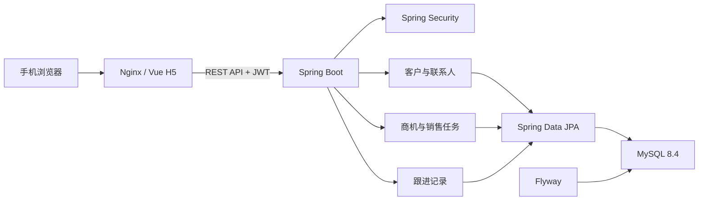

# ZhuaTech CRM 架构说明

Copyright © 2026 上海如静知华信息科技有限公司。

## 设计目标

社区源码版采用“前后端分离 + 模块化单体”架构，围绕客户生命周期组织领域对象，适合个人学习 CRM 业务建模，也可作为取得商业授权后的定制开发基础。

## 核心关系

- `UserAccount`：销售人员、销售经理或管理员，是客户和商机的数据负责人。
- `Customer`：CRM 聚合入口，记录等级、状态、来源、负责人和下次跟进日期。
- `Contact`：隶属于客户，可标记主要联系人。
- `Opportunity`：关联客户与负责人，记录金额、阶段、概率和预计成交日期。
- `FollowUp`：关联客户，可选关联商机，保存沟通内容和下一步计划。
- `SalesTask`：归属于销售人员，可选关联客户，用于管理推进事项。
- `AuditEvent`：保存业务修改的操作者、对象、时间和少量非敏感摘要；记录与业务修改同一事务提交。

销售人员只能访问自己负责的客户数据，销售经理和管理员拥有团队视角。该规则集中在 `CrmAccessService`，避免控制器各自实现不一致的数据权限。

## 工程分层

- `controller`：REST 接口、参数校验和用例编排。
- `service`：当前用户与 CRM 数据范围等复用规则。
- `model`：JPA 实体和业务状态变化。
- `repository`：Spring Data JPA 数据访问。
- `security` / `config`：JWT、Spring Security、CORS 和示例数据。
- `common`：统一响应、业务异常和全局异常处理。

所有 Java 代码使用 `cn.zhuatech.crm` 根包。数据库结构由 Flyway 管理；已发布迁移不得修改，后续变更应新增迁移版本。

## 生产增强建议

社区源码版仅供个人非商业学习。已有核心业务修改的最近 100 条审计查询和数据库备份恢复脚本；正式环境仍需制定审计留存与外部归档、登录限流、字段级权限、客户去重、数据脱敏、附件存储、监控告警、HTTPS 和密钥托管方案。

架构咨询与深度定制：[知华科技](https://www.zhuatech.cn/)（上海如静知华信息科技有限公司）。
